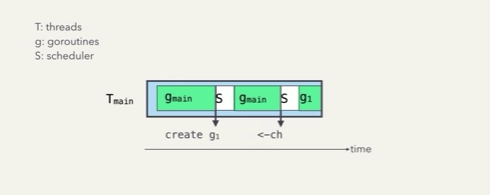

### what is goroutines
* user-space threads
* managed entirely by the go runtime
* lighter-weight and cheaper
* faster creation, destruction, context switches
* 

| GOROUTINE	         |THREAD
| ---------------------|-----------------
| Goroutines are managed by the go runtime.	|Operating system threads are managed by os.
| stack = 2kb  | thread stack = 8kb
| Goroutine are not hardware dependent.	|Threads are hardware dependent.
| Goroutines have easy communication medium known as channel.	|Thread doesnot have easy communication medium.
| Due to the presence of channel one goroutine can communicate with other goroutine with low latency.	|Due to lack of easy communication medium inter-threads communicate takes place with high latency.
| Goroutine doesnot have ID because go doesnot have Thread Local Storage.	|Threads have their own unique ID because they have Thread Local Storage.
| Goroutines are cheaper than threads.	|The cost of threads are higher than goroutine.
| They are cooperatively scheduled.	|They are preemptively scheduled.
| They have fasted startup time than threads.	They have slow startup time than goroutines.
| 
| Goroutine has growable segmented stacks.	|Threads doesnot have growable segmented stacks.

### 什么是阻塞
* asynchronous network IO
* sleeping
* channel operation
* system calls
* blocking on primitives in the sync package

### Go Runtime
* Go runtime manage how many OS threads to create 
* Go runtime manage how goroutines are mapped to and executed on OS threads.
* Go runtime manage assign P with a M
* Go runtime Create threads when needed, keey them around for reuse 
* An OS thread is typically assigned with multiple goroutines
* My Mac:  6 Cores, 12 virtual cores and 12 logical processor, I can execute 12 OS threads in parallel., Hyper-Threading

### Goroutine states
* Waiting
* Runnable
* Executing

### [Go Scheduler](https://www.youtube.com/watch?v=YHRO5WQGh0k)
* Global Run Queue (GRQ) , FIFO
* Local Run Queue (LRQ), FIFO
* Limit threads accessing runqueue
    * the number of cpu cores
    * too many , too much contention
    * too few,  won't use all the cpu cores

### communicate channel
* `traditional for`, loop read channel, need break loop， // 遍历chan
* `for range`, loop read channel, will break when chan is close,  // 遍历chan
* `select`, (case, timeout, default, ): once read channel, // Quit Channel, 如读的时候需要timeout终止， 写的时候需要quit bool手动终止
* `WaitGroup`, read all channel, WaitGroup, wg.add, wg.done, wg.wait, 等带多chan
* `worker pool`, 一般两chan， 一个tasks, 一个results，producer写tasks,  worker读tasks写results, consumers读results， 多chan遍历读写

### [go_concurrency_visualize](https://divan.dev/posts/go_concurrency_visualize)

### ping_pong, 一写一读 

### select, 读多chan中的一个

### waitGroup， 读多chan

### multiplexing,  读多chan，写入一个chan

### mutex , 多chan 加锁写全局遍历 

