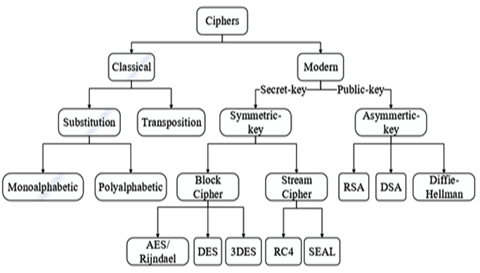

- **Hashing** [wiki](https://en.wikipedia.org/wiki/List_of_hash_functions)

- **Encryption or Ciphers**

* 可Decryption

- **Salting**

- **Encoding**
* 有Decode , 有Encode 
* base64, [code](../encoding/base64/base64.go)

