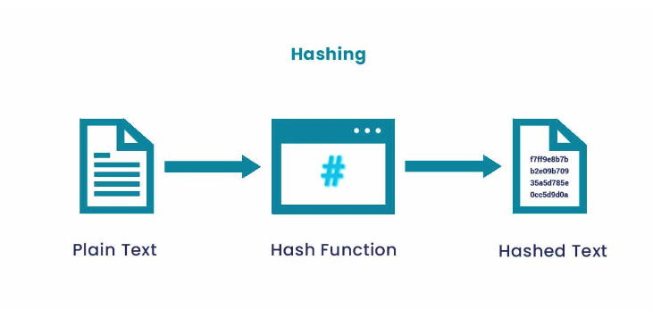
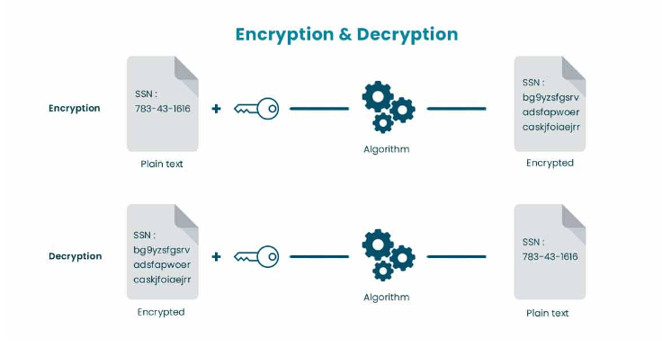
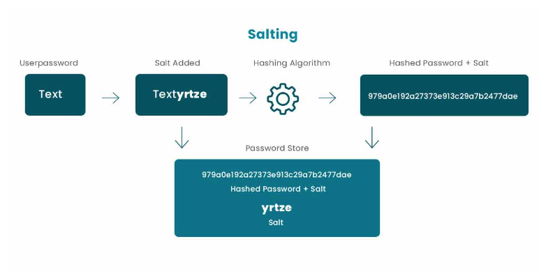
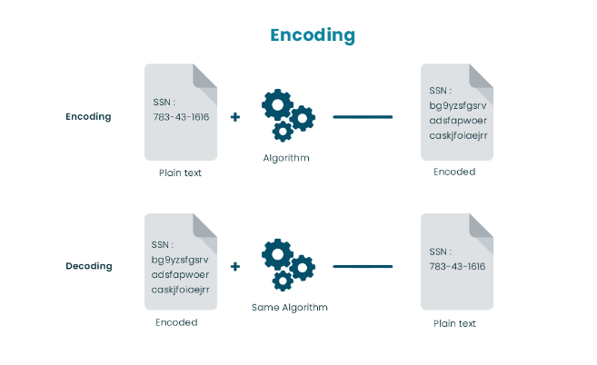

- **Hashing** [wiki](https://en.wikipedia.org/wiki/Cryptographic_hash_function) [MIT](https://ocw.mit.edu/courses/electrical-engineering-and-computer-science/6-046j-design-and-analysis-of-algorithms-spring-2015/lecture-notes/MIT6_046JS15_lec21.pdf)
  - md5, [wiki](https://en.wikipedia.org/wiki/MD5) |  [code](./hashing/md5/md5.go)
  - sha1, [wiki](./hashing/sha1) |[code](./hashing/sha1/sha1.go)
  - sha256, [wiki](https://en.wikipedia.org/wiki/Cryptographic_hash_function) |[code](./hashing/sha256/sha256.go)
  - sha512, [wiki](https://en.wikipedia.org/wiki/Cryptographic_hash_function) |[code](./hashing/sha512/sha512.go)
  - hmac, [wiki](https://en.wikipedia.org/wiki/HMAC)  |[code](./hashing/hmac/hmac.go)
  - bcrypt, [wiki](https://en.wikipedia.org/wiki/Bcrypt)  |[code](./hashing/hmac/hmac.go)
```
* not reversible, 不可逆
* 输入不定长， 输出定长
* no secret key
* fixed d, d越大越慢， collision概率越低
* Password Storage，用于密码的存储， 即md5值相同则密码验证成功
* Digital Signature， 用于检验数据是否有修改， 大数据是否完整
* 

```


- **Encryption or Ciphers** [MIT](https://ocw.mit.edu/courses/electrical-engineering-and-computer-science/6-046j-design-and-analysis-of-algorithms-spring-2015/lecture-notes/MIT6_046JS15_lec22.pdf)
   - aes, [code](encrypter_decrypter_cipher/aes/aes.go)
   - cipher, [code](encrypter_decrypter_cipher/cipher/cipher.go)  
   - des, [code](encrypter_decrypter_cipher) 
   - rc4, [code](encrypter_decrypter_cipher)
   - rsa, [code](encrypter_decrypter_cipher)



```
* Symmetric key encryption
* Asymmetric key encryption
* 有Encryption
* 有Decryption
* Caesar shift
* stream cipher
```


- **Salting**
*  not reversible, 不可逆
*  先添加一个random string, 之后hash





- **Encoding**
* 有Decode , 有Encode 
* base64, [code](../encoding/base64/base64.go)


