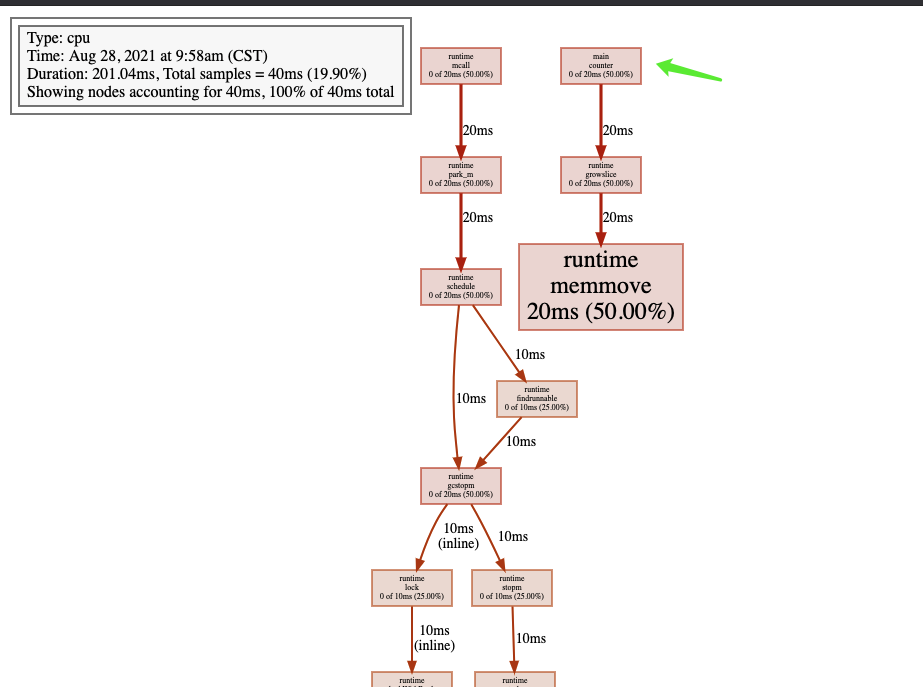
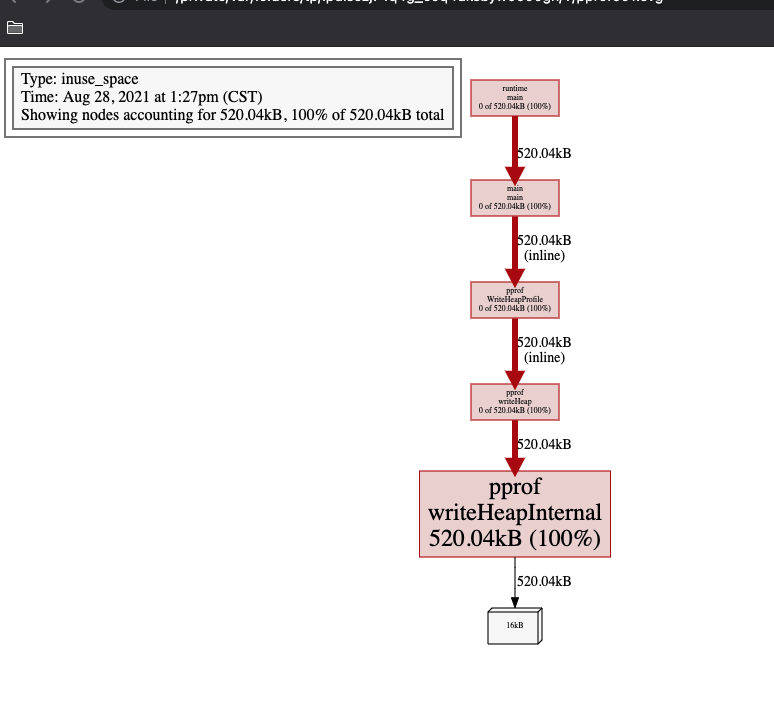
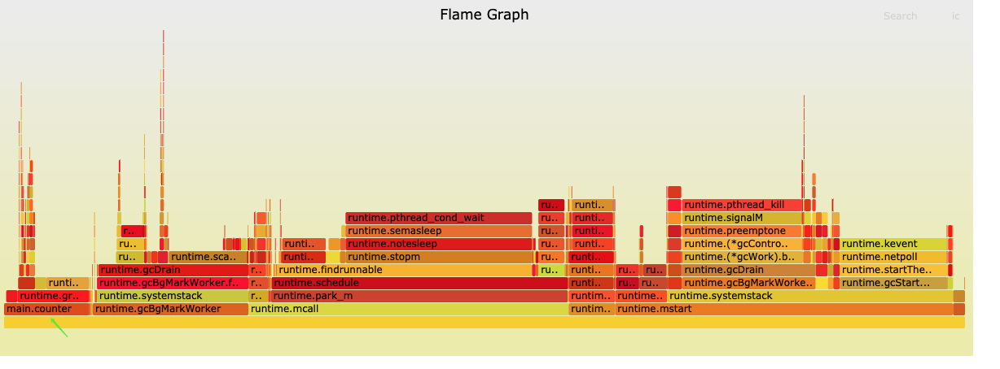

### tools

* brew install graphviz ， 图像生成及打开工具
    * go tool pprof web //根据身材的.pprof生成svg后浏览器打开
* go get -v github.com/uber/go-torch
  * go-torch，本质还是go tool pprof
* https://zhuanlan.zhihu.com/p/141640004

### runtime pprof cpu

* generator pprof file

``` 
➜  cpu git:(master) ✗ pwd 
/Users/betty/project/git_betty200744/ultimate-go/diagnostics/runtime_pprof/cpu
➜  cpu git:(master) ✗ go run ./main.go 
➜  cpu git:(master) ✗ ls
cpu.pprof main.go   mem.pprof
➜  runtime_pprof git:(master) ✗ 
```

* analyze pprof sample data

```
➜  runtime_pprof git:(master) ✗ go tool pprof cpu.pprof 
Type: cpu
Time: Aug 28, 2021 at 9:58am (CST)
Duration: 201.04ms, Total samples = 40ms (19.90%)
Entering interactive mode (type "help" for commands, "o" for options)
(pprof) top
Showing nodes accounting for 40ms, 100% of 40ms total
Showing top 10 nodes out of 17
      flat  flat%   sum%        cum   cum%
      20ms 50.00% 50.00%       20ms 50.00%  runtime.memmove
      10ms 25.00% 75.00%       10ms 25.00%  runtime.pthread_cond_wait
      10ms 25.00%   100%       10ms 25.00%  runtime.usleep
         0     0%   100%       20ms 50.00%  main.counter
         0     0%   100%       10ms 25.00%  runtime.findrunnable
         0     0%   100%       20ms 50.00%  runtime.gcstopm
         0     0%   100%       20ms 50.00%  runtime.growslice
         0     0%   100%       10ms 25.00%  runtime.lock (inline)
         0     0%   100%       10ms 25.00%  runtime.lock2
         0     0%   100%       10ms 25.00%  runtime.lockWithRank (inline)
(pprof) svg
Generating report in profile001.svg
(pprof) web

```



### runtime pprof mem

* generator pprof file

``` 
➜  cpu git:(master) ✗ pwd 
/Users/betty/project/git_betty200744/ultimate-go/diagnostics/runtime_pprof/mem
➜  cpu git:(master) ✗ go run ./main.go 
➜  cpu git:(master) ✗ ls
 main.go   mem.pprof

```

* analyze pprof sample data

```
➜  mem git:(master) ✗ go run main.go 
➜  mem git:(master) ✗ ls
main.go        mem.pprof      profile001.ps  profile001.svg
➜  mem git:(master) ✗ go tool pprof mem.pprof
Type: inuse_space
Time: Aug 28, 2021 at 1:27pm (CST)
Entering interactive mode (type "help" for commands, "o" for options)
(pprof) top
Showing nodes accounting for 520.04kB, 100% of 520.04kB total
      flat  flat%   sum%        cum   cum%
  520.04kB   100%   100%   520.04kB   100%  runtime/pprof.writeHeapInternal
         0     0%   100%   520.04kB   100%  main.main
         0     0%   100%   520.04kB   100%  runtime.main
         0     0%   100%   520.04kB   100%  runtime/pprof.WriteHeapProfile (inline)
         0     0%   100%   520.04kB   100%  runtime/pprof.writeHeap (inline)
(pprof) web


```




### http pprof mem

* run http service
```
➜  cpu git:(master) ✗ 
➜  cpu git:(master) ✗ go run main.go
http service: localhost:8000

➜  cpu git:(master) ✗ curl localhost:8000/get
hello http pprof%                                                                                                                                                              

```


* generator pprof cpu top , view in terminal
```
➜  cpu git:(master) ✗ go tool pprof -top -seconds 5 http://localhost:5017/debug/pprof/profile  
Fetching profile over HTTP from http://localhost:5017/debug/pprof/profile?seconds=5
Please wait... (5s)
Saved profile in /Users/betty/pprof/pprof.samples.cpu.038.pb.gz
Type: cpu
Time: Aug 28, 2021 at 2:04pm (CST)
Duration: 5.02s, Total samples = 80ms ( 1.59%)
Showing nodes accounting for 80ms, 100% of 80ms total
flat  flat%   sum%        cum   cum%
20ms 25.00% 25.00%       20ms 25.00%  runtime.kevent
20ms 25.00% 50.00%       20ms 25.00%  runtime.nanotime1
10ms 12.50% 62.50%       10ms 12.50%  runtime.(*pallocData).findScavengeCandidate
10ms 12.50% 75.00%       10ms 12.50%  runtime.pthread_cond_signal
10ms 12.50% 87.50%       10ms 12.50%  runtime.pthread_cond_wait
10ms 12.50%   100%       10ms 12.50%  runtime.scanobject
```


* generator pprof cpu ,visuallize graph through web browser

``` 
first : brew install graphviz
➜  cpu git:(master) ✗ go tool pprof -web -seconds 5 http://localhost:5017/debug/pprof/profile
Fetching profile over HTTP from http://localhost:5017/debug/pprof/profile?seconds=5
Please wait... (5s)
Saved profile in /Users/betty/pprof/pprof.samples.cpu.039.pb.gz
➜  cpu git:(master) ✗ 

```
* generator pprof cpu flamegraph , view in browser
```

1. go get -v github.com/uber/go-torch
2. git clone https://github.com/brendangregg/FlameGraph.git
go-torch -u http://localhost:5017 -t 30

```




### http pprof mem