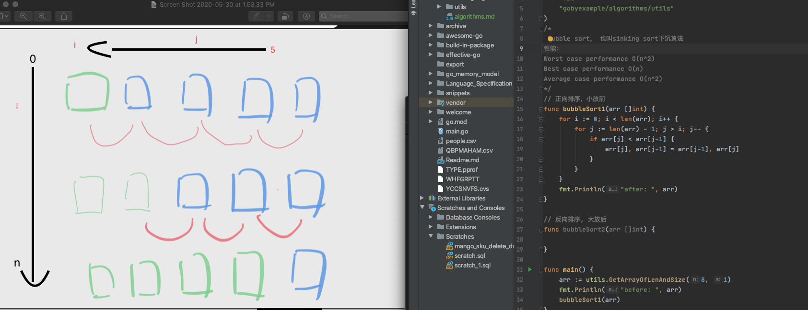
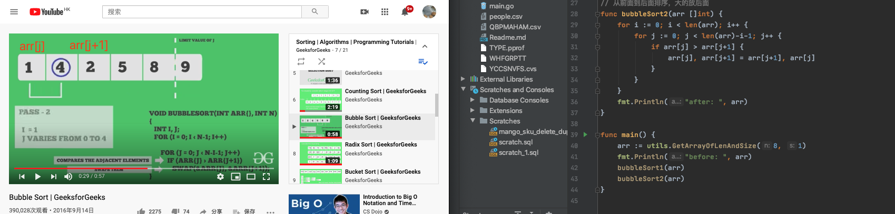

## Motivation

This repo contains my notes on learning Go and computer systems. Different people have different
learning style. For me, I learn best by doing and walking through examples. Hence, I am trying to
take notes carefully and comment directly on the source code, rather than writing up Markdown
files. That way, I can understand every single line of code as I am reading and also be mindful of
the theories behind the scene.

In the mix, I also include links to other articles that I find helpful.

## Table of Contents 

- **Language Specification**
  - **Syntax**
    - Variables: [Zero value concept | Initialization | Const](./Language_Specification/variables/variables.go)
    - Constant: [Initialization | iota](./Language_Specification/constant/constant.go)
    - Conversions: [Conversion](./Language_Specification/conversions/conversions.go)
    - Struct: [Declare_Initialize | Name And Anonymous type](Language_Specification/reference-type/struct/structs_Declare_Initialize.go) 
    [Field | Field Function| Iterate Field Name And Value | Selector and Promoted](Language_Specification/reference-type/struct/struct_field.go)  [Method Set](Language_Specification/reference-type/struct/struct_method_set.go) 
    - Struct Tags: [Wiki](https://github.com/golang/go/wiki/Well-known-struct-tags) [Code](Language_Specification/reference-type/struct/struct_tag.go) [Tag Doc](Language_Specification/reference-type/struct/struct_tags.md)
    - Pointer: 
      - [Passing by value | Escape analysis | Stack space | Garbage Collection](pointer.go)
      - [Golang's Code Review Receiver Type](https://github.com/golang/go/wiki/CodeReviewComments#receiver-type)
    - Function: [Initialization](function.go)
    - Build-in types: [Built-in types](Language_Specification/build-in-type)
  - **Data Structures**
    - Enum: [Enum](./Language_Specification/enum/enum.go)
    - Array: [CPU Cache | TLB | Initialization | Iteration | Type array | Contiguous memory allocation](array.go)
    - Slice: [Initialization | Length vs Capacity | Reference Type | Appending | Slice of Slice | Copy of Slice | UTF-8](slice.go)
    - Map: [Initialization | Iteration | Deleting | Finding | Restriction ](map.go)
  - **Decoupling**
    - Method: 
      - [Value and Pointer Receiver Call](Language_Specification/reference-type/method/methods_receiver.go)
      - [Value and Pointer Semantics](Language_Specification/reference-type/method/methods_receiver.go)
      - [Methods are just functions | Function variable](Language_Specification/reference-type/struct/struct_method_set.go)
      - [closures](./Language_Specification/closures/closures.go)
    - Interface: 
      - [Valueless type | Concrete type vs Interface type | Relationship | Polymorphic function](interface_1.go)
      - [Interface via Pointer Receiver | Method set | Slice of Interface](interface_2.go)
    - Embedding: 
      - [Declaring fields, NOT Embedding](embedding_1.go)
      - [Embedding type | Inner type promotion](embedding_2.go)
      - [Embedded type and Interface](embedding_3.go)
      - [Outer and inner type implementing the same Interface](embedding_4.go)
    - Exporting:
      - [Guideline](exporting/README.md)
      - [Exported identifier](exporting/exporting_1)
      - [Accessing a value of an unexported identifier](exporting/exporting_2)
      - [Unexported fields from an exported struct](exporting/exporting_3)
      - [Exported types with embedded unexported types](exporting/exporting_4)
- **Software Design**
  - Composition:
    [Guideline](https://github.com/ardanlabs/gotraining/tree/master/topics/go#interface-and-composition-design)
    - Grouping types: 
      - [Grouping By State](grouping_types_1.go)
      - [Grouping By Behavior](grouping_types_2.go)
    - Decoupling: 
      - [Struct Composition](decoupling_1.go)
      - [Decoupling With Interface](decoupling_2.go)
      - [Interface Composition](decoupling_3.go)
      - [Decoupling With Interface Composition](decoupling_4.go)
    - Conversion: 
      - [Interface Conversions | Type Assertion](conversion_1.go)
      - [Runtime Type Assertion](conversion_2.go)
    - Interface Pollution: 
      - [Interface Pollution](pollution_1.go)
      - [Remove Interface Pollution](pollution_2.go)
    - Mocking: 
      - [Package To Mock](mocking_1.go)
      - [Sample Client](mocking_2.go)
  - Error Handling: 
    - [Default error values](error_1.go)
    - [Error variables](error_2.go)
    - [Type as context](error_3.go)
    - [Behavior as context](error_4.go)
    - [Finding the bug/pitfall of nil value of error interface](error_5.go)
    - [Wrapping Errors](error_6.go)
  - Packaging: [Guideline](https://github.com/ardanlabs/gotraining/blob/master/topics/packaging/README.md)
  - Dependency management: [Go Modules](https://blog.golang.org/using-go-modules)
- **Design Pattern**
  - xxx: 
- **Concurrency**
  - **Mechanics**
    - Goroutine: 
      - [Go Scheduler Internals](goroutine_1.go)
      - [Language Mechanics](goroutine_2.go)
      - [Goroutine time slicing](goroutine_3.go)
      - [Goroutines and parallelism](goroutine_4.go)
    - Data race: 
      - [Race Detection](data_race_1.go)
      - [Atomic Functions](data_race_2.go)
      - [Mutexes](data_race_3.go)
      - [Read/Write Mutex](data_race_4.go)
    - Channel: 
      - [Guideline](https://github.com/ardanlabs/gotraining/tree/master/topics/go#concurrent-software-design)
      - [Language Mechanics | Unbuffered channel: Signaling with(out) data](channel_1.go)
      - [Unbuffered channel: Double signal | Buffered channel: Close and range | Unbuffered channel: select and receive | Unbuffered channel: select and send | Buffered channel: Select and drop](channel_2.go)
      - [Unbuffered channel (Tennis match)](channel_3.go)
      - [Unbuffered channel (Replay race)](channel_4.go)
      - [Buffered channel: Fan Out](channel_5.go)
      - [Select](channel_6.go)
  - **Patterns**
    - Context: 
      - [Store and retrieve values from a context](context_1.go)
      - [WithCancel](context_2.go)
      - [WithDeadline](context_3.go)
      - [WithTimeout](context_4.go)
      - [Request/Response](context_5.go)
    - Pattern
      - Task
      - Logger
- **Testing and Profiling**
  - Testing: 
    - [Basic Unit Test](basic_test.go)
    - [Table Test](table_test.go)
    - [Sub Test](sub_test.go)
    - [Web Server](web_server)
    - [Mock Server](web_test.go)
    - [Test Coverage](README.md)
  - Benchmarking
    - [Basic Benchmark](basic_test.go)
    - [Sub Benchmark](sub_test.go)
  - Fuzzing
    - [Guideline](https://github.com/ardanlabs/gotraining/blob/master/topics/fuzzing/README.md)
  - Profiling
    - Stack Trace: [Review](stack_trace_1.go) | [Packing](stack_trace_2.go)
    - GODEBUG: [Memory Tracing](memory_tracing.go)
    
- **Algorithms** [Algorithms](./algorithms/algorithms.md)
   - Data Structures
     - [Binary Search Tree](./algorithms/data-structures/tree/binary_search_tree) [(wiki)](https://en.wikipedia.org/wiki/Binary_search_tree) [(mit)](https://ocw.mit.edu/courses/electrical-engineering-and-computer-science/6-006-introduction-to-algorithms-fall-2011/lecture-videos/MIT6_006F11_lec05.pdf)
     - [Binary Tree](./algorithms/data-structures/tree/binary_tree) [(wiki)](http://en.wikipedia.org/wiki/Binary_tree)
     - [Graph]()[(wiki)](http://en.wikipedia.org/wiki/Graph_%28abstract_data_type)
     - [Hash Tables](./algorithms/data-structures/hashing) [(wiki)](http://en.wikipedia.org/wiki/Hash_table)
     - [Linked List](./algorithms/data-structures/lists/lists.go) [(wiki)](http://en.wikipedia.org/wiki/Linked_list)
         - [Singly Linked List](./algorithms/data-structures/lists/singlylinkedlist/singlylinkedlist.go) [(wiki)](https://en.wikipedia.org/wiki/Linked_list#Singly_linked_list)
         - [Doubly linked list](./algorithms/data-structures/lists/doublelinkedlist/doublelinkedlist.go) [(wiki)](https://en.wikipedia.org/wiki/Doubly_linked_list)
     - [Matrix]()[(wiki)](http://en.wikipedia.org/wiki/Matrix_(mathematics))
     - [Max Heap](./algorithms/data-structures/heap/maxheap/maxheap.go) [(wiki)](http://en.wikipedia.org/wiki/Heap_%28data_structure%29)
     - [Min Heap](./algorithms/data-structures/heap/minheap/minheap.go) [(wiki)](http://en.wikipedia.org/wiki/Heap_%28data_structure%29)
     - [Priority Queue](./algorithms/data-structures/queue/queue.go) [(wiki)](http://en.wikipedia.org/wiki/Priority_queue)
     - [Queue](./algorithms/data-structures/queue/queue.go)[(wiki)](http://en.wikipedia.org/wiki/Queue_%28abstract_data_type%29)
     - [Stack](./algorithms/data-structures/stack/stack.go)[(wiki)](http://en.wikipedia.org/wiki/Stack_%28abstract_data_type%29)
   
   - Graph algorithms
     - Searching:
       - [Depth First Search]() [(wiki)](http://en.wikipedia.org/wiki/Depth-first_search)
       - [Breadth First Search]() [(wiki)](http://en.wikipedia.org/wiki/Breadth-first_search)
   
   - hortest path:
     - [Dijkstra]()[(wiki)](http://en.wikipedia.org/wiki/Dijkstra%27s_algorithm)
   
   - Sorting:
     - [Topological Sort]() [(wiki)](http://en.wikipedia.org/wiki/Topological_sorting)
   - Maths algorithms
     - [Binary GCD algorithm]() [(wiki)](https://en.wikipedia.org/wiki/Binary_GCD_algorithm)
     - [Closest pairs]() [(wiki)](http://en.wikipedia.org/wiki/Closest_pair_of_points_problem)
     - [FastPower]()[(wiki)](http://en.wikipedia.org/wiki/Exponentiation_by_squaring)
     - [Fibonacci]()[(wiki)](http://en.wikipedia.org/wiki/Fibonacci_number)
     - [Fisher-Yates Shuffle-yates]() [(wiki)](http://en.wikipedia.org/wiki/Fisher%E2%80%93Yates_shuffle)
     - [Erastothenes Sieve]() [(wiki)](https://en.wikipedia.org/wiki/Sieve_of_Eratosthenes)
     - [Extented GCD algorithm]() [(wiki)](http://en.wikipedia.org/wiki/Extended_Euclidean_algorithm)
     - [Karatsuba's Multiplication]() [(wiki)](http://en.wikipedia.org/wiki/Karatsuba_algorithm)
     - [Newton's Squarenewton-sqrt]() [(wiki)](http://en.wikipedia.org/wiki/Newton%27s_method)
     - [Permutations Count]()
     - [Strassen's matrixstrassen]() [(wiki)](http://en.wikipedia.org/wiki/Strassen_algorithm)
   
   - Sorting algorithms
     - [Bubble Sort](sorting-algorithms/bubble-sort/bubble-sort.go) [(wiki)](http://en.wikipedia.org/wiki/Bubble_sort)
   
   
   
   
     - [Heap Sort](sorting-algorithms/heap-sort/heap-sort.go) [(mit notes)](https://ocw.mit.edu/courses/electrical-engineering-and-computer-science/6-006-introduction-to-algorithms-fall-2011/lecture-videos/MIT6_006F11_lec04.pdf) [(wiki)](http://en.wikipedia.org/wiki/Heapsort)
     - [Quick Sort](sorting-algorithms/quick_sort/quick_sort.go)[(mit notes)]() [(wiki)](http://en.wikipedia.org/wiki/Quicksort)
     - [Merge Sort](sorting-algorithms/merge_sort/merge_sort.go) [(mit notes)](https://ocw.mit.edu/courses/electrical-engineering-and-computer-science/6-006-introduction-to-algorithms-fall-2011/lecture-videos/MIT6_006F11_lec03.pdf) [(wiki)](http://en.wikipedia.org/wiki/Merge_sort)
     - [Insertion Sort](sorting-algorithms/insertion-sort/insertion-sort.go)[(mit notes)](https://ocw.mit.edu/courses/electrical-engineering-and-computer-science/6-006-introduction-to-algorithms-fall-2011/lecture-videos/MIT6_006F11_lec03.pdf) [(wiki)](http://en.wikipedia.org/wiki/Insertion_sort)
     - [Shell Sort](sorting-algorithms/shell-sort/shell-sort.go)[(mit notes)]() [(wiki)](http://en.wikipedia.org/wiki/Shellsort)
     - [Selection Sort](sorting-algorithms/select_sort/select_sort.go) [(mit notes)]() [(wiki)](http://en.wikipedia.org/wiki/Selection_sort)
   
   - Searching algorithms
     - [Binary Search]() [(wiki)](http://en.wikipedia.org/wiki/Binary_search_algorithm)
   
    
- **Awesome Go**
  - [bazel]() 