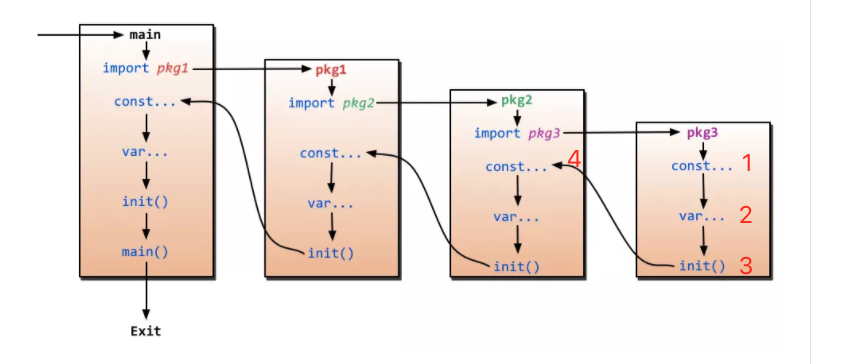
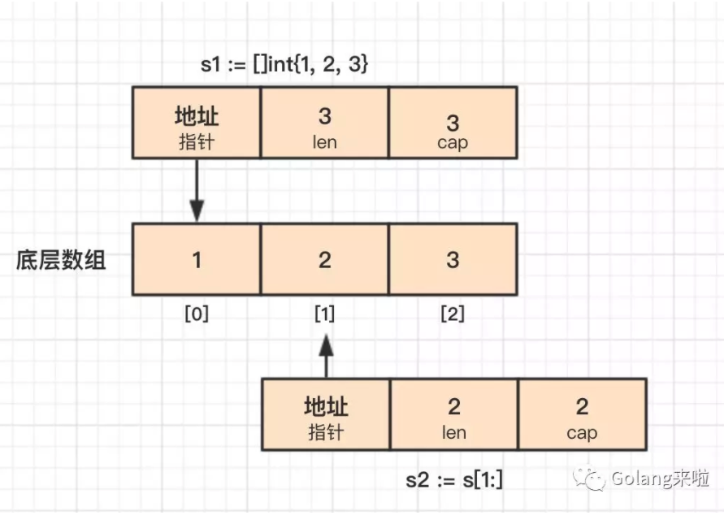

## Motivation

This repo contains my notes on work with Go and computer systems

## Table of Contents 
- **Language Specification**
  - **Syntax**
    - Variables: [Zero value concept | Initialization | Const](./Language_Specification/variables/variables.go)
    - Constant: [Initialization | iota](./Language_Specification/constant/constant.go)
    - Conversions: [Conversion](./Language_Specification/conversions/conversions.go)
    - Struct: [Declare_Initialize | Name And Anonymous type](Language_Specification/reference-type/struct/structs_Declare_Initialize.go) 
    [Field | Field Function| Iterate Field Name And Value | Selector and Promoted](Language_Specification/reference-type/struct/struct_field.go) | [Method Set](Language_Specification/reference-type/struct/struct_method_set.go) 
    - Struct Tags: [Wiki](https://github.com/golang/go/wiki/Well-known-struct-tags) | [Code](Language_Specification/reference-type/struct/struct_tag.go) | [Tag-Doc](Language_Specification/reference-type/struct/struct_tags.md)
    - Pointer: 
      - [Passing by value | Escape analysis | Stack space ](./Language_Specification/build-in-type/pointers/pointers.go)
    - Function: [Initialization | argument | multiple returns | named return ](./Language_Specification/reference-type/function/functions.go)
    - Build-in types: [Built-in types](Language_Specification/build-in-type)
    - statement: [statement](./Language_Specification/statements/statements.md) | [if else](./Language_Specification/statements/if_else.go) | [for](./Language_Specification/statements/for.go) | [switch](./Language_Specification/statements/switch.go) | [select](./Language_Specification/statements/select.go) | [go](https://golang.org/ref/spec#Go_statements)
  - **Data Structures**
    - Enum: [Enum](./Language_Specification/enum/enum.go)
    - Array: [CPU Cache | TLB | Initialization | Iteration | Type array | Contiguous memory allocation](Language_Specification/reference-type/array/arrays.go)
    - Slice: [Initialization | Length vs Capacity | Reference Type | Appending | Slice of Slice](./Language_Specification/reference-type/slice/slices_cheat_sheet.go) | [Map | Reduce | Filter | Include | All|Any ](./Language_Specification/reference-type/slice/slice_collection_function.go)
    - Map: [Initialization | Iteration | Deleting | Finding | Restriction ](./Language_Specification/reference-type/map/maps.go)
    - Channel: [Declare | Iteration | Exit | send statements |receive operations](./Language_Specification/reference-type/channel/channel_test.go)
  - **Decoupling**
    - Method: 
      - [Value and Pointer Receiver Call](Language_Specification/reference-type/method/methods_receiver.go) | [wiki](https://github.com/golang/go/wiki/CodeReviewComments#receiver-type)
      - [Value and Pointer Semantics](Language_Specification/reference-type/method/methods_receiver.go)
      - [Methods are just functions | Function variable](Language_Specification/reference-type/struct/struct_method_set.go)
      - [closures](./Language_Specification/closures/closures.go)
    - Interface: 
      - [Declaring |Type assertions| Concrete type vs Interface type| Polymorphic function](./Language_Specification/reference-type/interfaces/interfaces_cheat_sheet.go)
    - Embedding: 
      - [Declaring fields, NOT Embedding](Language_Specification/reference-type/struct_embedding/slice_embedding.go)
      - [Embedding type | Inner type promotion](Language_Specification/reference-type/struct_embedding/slice_embedding.go)
      - [Embedded type and Interface](Language_Specification/reference-type/struct_embedding/slice_embedding.go)
      - [Outer and inner type implementing the same Interface](Language_Specification/reference-type/struct_embedding/slice_embedding.go)
    - Exporting:
      - [Exported identifier](./Language_Specification/exporting/exporting.go)
      - [Accessing a value of an unexported identifier](./Language_Specification/exporting/exporting.go)
      - [Unexported fields from an exported struct](./Language_Specification/exporting/exporting.go)
  - **Dependency management** [Go Modules](./go_module.md)
  - **Error Handling** 
    - [Default error values](./design-pattern/go-design/error_handling/error_handling.go)
    - [Error variables](./design-pattern/go-design/error_handling/error_handling.go) | [best practices](https://github.com/grpc/grpc-go/blob/master/codes/codes.go)
    - [Type as context](./design-pattern/go-design/error_handling/error_handling.go)
    - [Wrapping Errors](./design-pattern/go-design/grpc_go_error_handling)
  - **Context** 
    - [Store and retrieve values from a context](./build-in-package/context/context_cheat_sheet.go)
    - [WithCancel](./build-in-package/context/context_cheat_sheet.go)
    - [WithDeadline](./build-in-package/context/context_cheat_sheet.go)
    - [WithTimeout](./build-in-package/context/context_cheat_sheet.go)
    - [Request/Response](context_5.go)
- **Concurrency** [LearnConcurrency](https://github.com/golang/go/wiki/LearnConcurrency)
  - Goroutine
    - [asynchronous network IO](./LearnConcurrency/basics/basics.go)
    - [Go Scheduler Internals](goroutine_1.go)
    - [Language Mechanics](goroutine_2.go)
    - [Goroutine time slicing](goroutine_3.go)
    - [Goroutines and parallelism](goroutine_4.go)
  - Data race
    - [Race Detection](data_race_1.go)
    - [Atomic Functions](data_race_2.go)
    - [Mutexes](data_race_3.go)
    - [Read/Write Mutex](data_race_4.go)
  - [Channel](./LearnConcurrency/learn_concurrency.md) 
    - [Guideline](https://github.com/ardanlabs/gotraining/tree/master/topics/go#concurrent-software-design)
    - [ping_pong](./LearnConcurrency/communicate_channel/ping_pong/ping_pong.go)
    - [multiplexing](./LearnConcurrency/communicate_channel/multiplexing/multiplexing.go)
    - [waitgroup](./LearnConcurrency/communicate_channel/waitgroup/waitgroup.go)
    - [mutex](./LearnConcurrency/communicate_channel/mutex/mutex.go)
    - [worker_pool](./LearnConcurrency/communicate_channel/worker_pool/worker_pool.go)
    - [Select](./LearnConcurrency/communicate_channel/ping_pong/ping_pong.go)
- **Diagnostics Profiling**
  - Diagnostics [Diagnostics ](./diagnostics/profiling/profiling.md)
  - Profiling [code](./diagnostics/profiling/pprof)
  - Stack Trace: [Review](./diagnostics/profiling/pprof)
  - GoLand Debug: [GoLand Debug](./diagnostics/goland_debug/goland_debug.go) | [blog](https://blog.jetbrains.com/go/2020/03/03/how-to-find-goroutines-during-debugging/) 
- **Testing**
  - Testing: 
    - [Basic Unit Test](./main_test.go)
    - [Web Server](awesome-go/bazel/go-tutorial/test/publish_test.go)
    - [Mock](mock/golang/mock/) | [Mock Server](./awesome-go/grpc-go-mock/mock_helloworld/hw_mock.go)
  - Fuzzing
    - [Guideline](https://github.com/ardanlabs/gotraining/blob/master/topics/fuzzing/README.md)
- **Design Pattern** [Design Patterns](https://en.wikipedia.org/wiki/Design_Patterns) | [javatpoint](https://www.javatpoint.com/prototype-design-pattern)
  - SOLID: [SOLID](https://en.wikipedia.org/wiki/SOLID) 
  - Creational
    - Simple Factory: [wiki](https://en.wikipedia.org/wiki/Factory_(object-oriented_programming)) | [code](./design-pattern/creational/simple_factory) | [best practices](./awesome-go/go-redis/main.go)
    - *Abstract factory: [wiki](https://en.wikipedia.org/wiki/Abstract_factory_pattern) | [code](./design-pattern/creational/abstract_factory/abstract_factory.go) | [best practices]()
    - *Builder: [wiki](https://en.wikipedia.org/wiki/Builder_pattern) | [code1](./design-pattern/creational/builder/builder.go) | [code2](./design-pattern/creational/builder/builder2.go) | [best practices orm query build](./awesome-go/gorm/gorm_query_build.go) | [best practices es query build](https://github.com/olivere/elastic/wiki/Search)
    - Factory method: [wiki](https://en.wikipedia.org/wiki/Factory_method_pattern) | [code](./design-pattern/creational/factory_method/factory_method.go) | [best practices](./awesome-go/kafkaSarama/sarama_comsumer_group.go)
    - *Object Pool Pattern: [wiki](https://golangbyexample.com/golang-object-pool/) | [code](./design-pattern/creational/object_pool/object_pool.go) | [best practices bilibili redis pool](https://github.com/whjstc/openbilibili-go-common-1/tree/master/library/cache/redis) 
    - *Prototype: [wiki](https://en.wikipedia.org/wiki/Prototype_pattern) | [code](./design-pattern/creational/prototype/prototype.go) | [best practices](./awesome-go/grpc-go/helloworld/greeter_client/main.go) 
    - *Singleton: [wiki](https://en.wikipedia.org/wiki/Singleton_pattern) | [code](./design-pattern/creational/singleton) | [best practices]() 
  - Structual
    - Adapter: [wiki](https://en.wikipedia.org/wiki/Adapter_pattern) | [code](./design-pattern/structual/adapter/adapter.go) | [best practices](./awesome-go/go-redis/redisClient/redis.go) 
    - *Bridge: [wiki](https://en.wikipedia.org/wiki/Bridge_pattern) | [code](./design-pattern/structual/bridge/bridge.go) | [best practices]() 
    - Composite: [wiki](https://en.wikipedia.org/wiki/Composite_pattern) | [code](./design-pattern/structual/bridge/bridge.go) | [best practices](./algorithms/data-structures/tree/binary_search_tree/binary_search_tree.go) 
    - *Decorator: [wiki](https://en.wikipedia.org/wiki/Decorator_pattern) | [code](./design-pattern/structual/decorator/decorator.go) | [best practices](https://github.com/avast/retry-go) 
    - Facade: [wiki](https://en.wikipedia.org/wiki/Facade_pattern) | [code](./design-pattern/structual/facade/facade.go) | [best practices]() 
    - Flyweight: todo[wiki]() | [code]() | [best practices]() 
    - Proxy: todo[wiki]() | [code]() | [best practices]() 
  - Behavioral
    - *Chain of responsibility: [wiki](https://en.wikipedia.org/wiki/Chain-of-responsibility_pattern) | [code](./design-pattern/behavioral/chain_of_responsibility/chain_of_responsibility.go) | [best practices](./awesome-go/gin/gin.go) 
    - Command: todo [wiki]() | [code]() | [best practices]() 
    - *Interpreter: todo[wiki]() | [code]() | [best practices]() 
    - *Iterator: [wiki](https://en.wikipedia.org/wiki/Iterator_pattern) | [code]() | [best practices]() 
    - Mediator: todo[wiki]() | [code]() | [best practices]() 
    - Memento: todo[wiki]() | [code]() | [best practices]() 
    - Observer: todo[wiki]() | [code]() | [best practices]() 
    - State: todo[wiki]() | [code]() | [best practices]() 
    - *Strategy: [wiki](https://en.wikipedia.org/wiki/Strategy_pattern) | [code]() | [best practices](./awesome-go/kafkaSarama/sarama_comsumer_group.go) 
    - Template method : todo[wiki]() | [code]() | [best practices]() 
    - Visitor: todo[wiki]() | [code]() | [best practices]() 
  - Composition:
    [Guideline](https://github.com/ardanlabs/gotraining/tree/master/topics/go#interface-and-composition-design)
    - Conversion: 
      - [Interface Conversions | Type Assertion](./design-pattern/go-design/conversion/conversion.go)
      - [Runtime Type Assertion](./design-pattern/go-design/runtime_type_assertion/runtime_type_assertion.go)    
- **Algorithms** [Algorithms](./algorithms/algorithms.md)
   - 8.2 
   - Data Structures
     - [Binary Search Tree](./algorithms/data-structures/tree/binary_search_tree) |  [(wiki)](https://en.wikipedia.org/wiki/Binary_search_tree) | [(mit)](https://ocw.mit.edu/courses/electrical-engineering-and-computer-science/6-006-introduction-to-algorithms-fall-2011/lecture-videos/MIT6_006F11_lec05.pdf)
     - [Binary Tree](./algorithms/data-structures/tree/binary_tree) |  [(wiki)](http://en.wikipedia.org/wiki/Binary_tree)
     - [Graph]()[(wiki)](http://en.wikipedia.org/wiki/Graph_%28abstract_data_type)
     - [Hash Tables](./algorithms/data-structures/hashing)   | [(wiki)](http://en.wikipedia.org/wiki/Hash_table)
     - [Linked List](./algorithms/data-structures/lists/lists.go)   | [(wiki)](http://en.wikipedia.org/wiki/Linked_list)
         - [Singly Linked List](./algorithms/data-structures/lists/singlylinkedlist/singlylinkedlist.go)   |  [(wiki)](https://en.wikipedia.org/wiki/Linked_list#Singly_linked_list)
         - [Doubly linked list](./algorithms/data-structures/lists/doublelinkedlist/doublelinkedlist.go)   |  [(wiki)](https://en.wikipedia.org/wiki/Doubly_linked_list)
     - [Matrix]()  | [(wiki)](http://en.wikipedia.org/wiki/Matrix_(mathematics))
     - [Max Heap](./algorithms/data-structures/heap/maxheap/maxheap.go)   | [(wiki)](http://en.wikipedia.org/wiki/Heap_%28data_structure%29)
     - [Min Heap](./algorithms/data-structures/heap/minheap/minheap.go)   | [(wiki)](http://en.wikipedia.org/wiki/Heap_%28data_structure%29)
     - [Priority Queue](./algorithms/data-structures/queue/queue.go)   | [(wiki)](http://en.wikipedia.org/wiki/Priority_queue)
     - [Queue](./algorithms/data-structures/queue/queue.go)  | [(wiki)](http://en.wikipedia.org/wiki/Queue_%28abstract_data_type%29)
     - [Stack](./algorithms/data-structures/stack/stack.go)  | [(wiki)](http://en.wikipedia.org/wiki/Stack_%28abstract_data_type%29)
   - Graph algorithms
     - Searching:
       - [Depth First Search]()   |  [(wiki)](http://en.wikipedia.org/wiki/Depth-first_search)
       - [Breadth First Search]()   |  [(wiki)](http://en.wikipedia.org/wiki/Breadth-first_search)
   - hortest path:
     - [Dijkstra]()  | [(wiki)](http://en.wikipedia.org/wiki/Dijkstra%27s_algorithm)
   - Sorting:
     - [Topological Sort]()   |  [(wiki)](http://en.wikipedia.org/wiki/Topological_sorting)
   - Maths algorithms
     - [Binary GCD algorithm]()   |  [(wiki)](https://en.wikipedia.org/wiki/Binary_GCD_algorithm)
     - [Closest pairs]()   | [(wiki)](http://en.wikipedia.org/wiki/Closest_pair_of_points_problem)
     - [FastPower]()  | [(wiki)](http://en.wikipedia.org/wiki/Exponentiation_by_squaring)
     - [Fibonacci]()  | [(wiki)](http://en.wikipedia.org/wiki/Fibonacci_number)
     - [Fisher-Yates Shuffle-yates]()   |  [(wiki)](http://en.wikipedia.org/wiki/Fisher%E2%80%93Yates_shuffle)
     - [Erastothenes Sieve]()   |  [(wiki)](https://en.wikipedia.org/wiki/Sieve_of_Eratosthenes)
     - [Extented GCD algorithm]()   |  [(wiki)](http://en.wikipedia.org/wiki/Extended_Euclidean_algorithm)
     - [Karatsuba's Multiplication]()   |  [(wiki)](http://en.wikipedia.org/wiki/Karatsuba_algorithm)
     - [Newton's Squarenewton-sqrt]()   |  [(wiki)](http://en.wikipedia.org/wiki/Newton%27s_method)
     - [Permutations Count]()
     - [Strassen's matrixstrassen]() |  [(wiki)](http://en.wikipedia.org/wiki/Strassen_algorithm)
   - Sorting algorithms
     - [Bubble Sort](algorithms/sorting-algorithms/bubble-sort/bubble-sort.go) | [(wiki)](http://en.wikipedia.org/wiki/Bubble_sort)
     - [Heap Sort](algorithms/sorting-algorithms/heap-sort/heap-sort.go) [(mit notes)](https://ocw.mit.edu/courses/electrical-engineering-and-computer-science/6-006-introduction-to-algorithms-fall-2011/lecture-videos/MIT6_006F11_lec04.pdf) | [(wiki)](http://en.wikipedia.org/wiki/Heapsort)
     - [Quick Sort](algorithms/sorting-algorithms/quick_sort/quick_sort.go)[(mit notes)]() | [(wiki)](http://en.wikipedia.org/wiki/Quicksort)
     - [Merge Sort](algorithms/sorting-algorithms/merge_sort/merge_sort.go) [(mit notes)](https://ocw.mit.edu/courses/electrical-engineering-and-computer-science/6-006-introduction-to-algorithms-fall-2011/lecture-videos/MIT6_006F11_lec03.pdf) | [(wiki)](http://en.wikipedia.org/wiki/Merge_sort)
     - [Insertion Sort](algorithms/sorting-algorithms/insertion-sort/insertion-sort.go)[(mit notes)](https://ocw.mit.edu/courses/electrical-engineering-and-computer-science/6-006-introduction-to-algorithms-fall-2011/lecture-videos/MIT6_006F11_lec03.pdf) | [(wiki)](http://en.wikipedia.org/wiki/Insertion_sort)
     - [Shell Sort](algorithms/sorting-algorithms/shell-sort/shell-sort.go)[(mit notes)]() | [(wiki)](http://en.wikipedia.org/wiki/Shellsort)
     - [Selection Sort](algorithms/sorting-algorithms/select_sort/select_sort.go) [(mit notes)]() | [(wiki)](http://en.wikipedia.org/wiki/Selection_sort)
   - Searching algorithms
     - [Binary Search]() | [(wiki)](http://en.wikipedia.org/wiki/Binary_search_algorithm)
- **Crypto**
   - **Hashing** [wiki](https://en.wikipedia.org/wiki/Cryptographic_hash_function) | [MIT](https://ocw.mit.edu/courses/electrical-engineering-and-computer-science/6-046j-design-and-analysis-of-algorithms-spring-2015/lecture-notes/MIT6_046JS15_lec21.pdf)
     - md5, [wiki](https://en.wikipedia.org/wiki/MD5) |  [code](./build-in-package/crypto/hashing/md5/md5.go)
     - sha1, [wiki](./build-in-package/crypto/hashing/sha1) |[code](./build-in-package/crypto/hashing/sha1/sha1.go)
     - sha256, [wiki](https://en.wikipedia.org/wiki/Cryptographic_hash_function) |[code](./build-in-package/crypto/hashing/sha256/sha256.go)
     - sha512, [wiki](https://en.wikipedia.org/wiki/Cryptographic_hash_function) |[code](./build-in-package/crypto/hashing/sha512/sha512.go)
     - hmac, [wiki](https://en.wikipedia.org/wiki/HMAC)  |[code](./build-in-package/crypto/hashing/hmac/hmac.go)
     - bcrypt, [wiki](https://en.wikipedia.org/wiki/Bcrypt)  |[code](./build-in-package/crypto/hashing/hmac/hmac.go)
   - **Encryption or Ciphers** [MIT](https://ocw.mit.edu/courses/electrical-engineering-and-computer-science/6-046j-design-and-analysis-of-algorithms-spring-2015/lecture-notes/MIT6_046JS15_lec22.pdf)
      - aes, [code](./build-in-package/crypto/encryption_cipher/aes/aes.go)
      - cipher, [code](./build-in-package/crypto/encryption_cipher/cipher/cipher.go)  
      - des, [code](./build-in-package/crypto/encryption_cipher) 
      - rc4, [code](./build-in-package/crypto/encryption_cipher)
      - rsa, [code](./build-in-package/crypto/encryption_cipher)
   - **Encoding**
      - base64, [code](./build-in-package/encoding/base64/base64.go)
- **Awesome Go**
  - [bazel](./awesome-go/bazel) 
  - [bazel go](./awesome-go/bazel/go-tutorial) 
  - [config](./awesome-go/myconfig/myconfig.go) 
  - [beego](./awesome-go/beego)
  - [go-redis](./awesome-go/go-redis)
  - [gorm](./awesome-go/gorm)
  - [iris](./awesome-go/iris)
  - [kafkaSarama](./awesome-go/kafkaSarama)
  - [mapstructure](./awesome-go/mapstructure)
  - [grpc](./awesome-go/grpc-go)
  - [grpc mock](./awesome-go/grpc-go-mock)
  - [zipkin](./awesome-go/zipkin)
- *Interview*
  - defer的顺序，先进后出， 即压栈的顺序
  - defer与panic的运行，先defer, 后panic 
  - range, key, value, 注意key , value地址都是固定的， value才变
  - new(), make()区别， new返回pointer, 一般struct,  make 返回type, 一般make slice, map, channel
  - append(), 能传入pointer吗， 不能
  - go run order, 
  - 全局变量能用short declaration吗， 不能
  - 传value和传pointer的区别是？ 传value创建副本， 传pointer就是传本身
  - str := "hello", str[1] = 'a' 能修改吗， 不能， 因为"hello"是常量
  - ...int, 可变函数 
  - x, y := f(), 单赋值时， 不可以赋值给已经赋值的， 多赋值时， 可赋值给已经赋值的
  - string 类型能赋值为nil吗， 不能
  - slice， slice时共享底层内存 , 
  - if else, 块作用域，是整个if else
  - map range 是无序的吗？ 是
  - iota, 常量计数， iota 在 const 关键字出现时将被重置为0，const中每新增一行常量声明将使 iota 计数一次
  - map[string]*Math{"foo": &Math{2, 3}}, value类型是pointer才可以m["foo"].x
  - slice能==比较吗？不能
  - range slice,  循环次数在循环开始前就已经确定，循环内改变切片的长度，不影响循环次数
  - 给nil channel发送or接收数据， 会永久阻塞
  - 给close channel发送数据， 会panic
  - 给close channel接收数据, 如果无数据则返回0
  - panic, nil解析， index out of range, panic()
  - 有方向的 channel 不可以被关闭
  - 指针不支持索引
  - Go 语言中，大括号不能放在单独的一行, 除非是code block